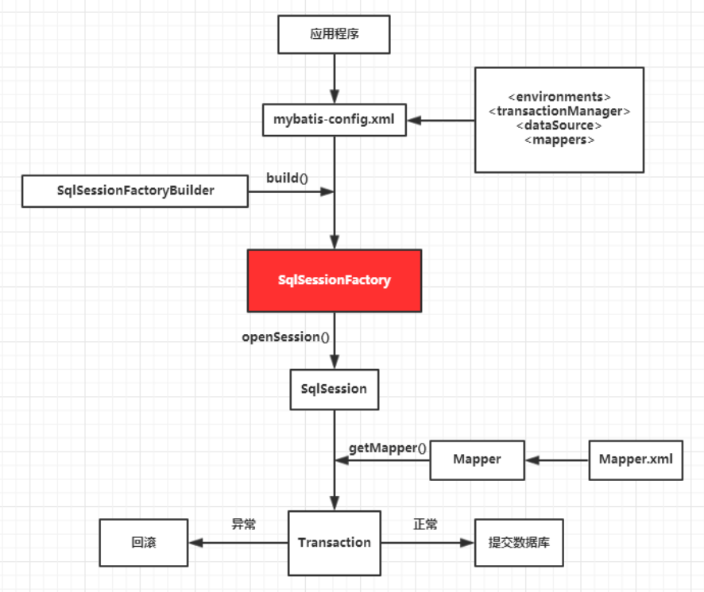

<!-- TOC -->

* [Tips](#tips)
* [A Simple Mybatis Example](#a-simple-mybatis-example)
    * [@Mapper](#mapper)
* [show sql in log](#show-sql-in-log)
* [useGeneratedKeys & keyProperty](#usegeneratedkeys--keyproperty)
* [camel case to underscore](#camel-case-to-underscore)
* [`#{}` and `${}` in mybatis config sql](#-and--in-mybatis-config-sql)
* [@Param](#param)
* [returnType](#returntype)
    * [return List](#return-list)
    * [return Map](#return-map)
* [resultMap](#resultmap)
    * [association](#association)
    * [collection](#collection)
    * [Example](#example)
        * [POJO](#pojo)
        * [Mapper](#mapper-1)
            * [OrderItemMapper](#orderitemmapper)
            * [OrderMapper](#ordermapper)
    * [Template of ResultMap](#template-of-resultmap)
* [分步查询](#分步查询)
* [MyBatis DTD](#mybatis-dtd)
* [Query by Step](#query-by-step)
* [lazy loading](#lazy-loading)
* [Dynamic SQL](#dynamic-sql)
    * [`<if>` and `<where>`](#if-and-where)
    * [`<set>`](#set)
    * [`<trim>`](#trim)
    * [`<choose>` / `<when>` / `<otherwise>`](#choose--when--otherwise)
    * [`<foreach>`](#foreach)
    * [`<sql>`](#sql)

<!-- TOC -->

# Tips

1. in sql of mybatis xml, `<` and `>` must be replaced with `&lt;` and `&gt;`
    - `where salary &lt;= 10000` instead of `where salary <= 10000`

   | origin character | escaped character |
                  |------------------|-------------------|
   | `<`              | `&lt;`            |
   | `>`              | `&gt;`            |
   | `&`              | `&amp;`           |
   | `'`              | `&apos;`          |
   | `"`              | `&quot;`          |
   | `\`              | `&bsol;`          |

# A Simple Mybatis Example

- add depencency

```xml

<dependency>
    <groupId>org.mybatis.spring.boot</groupId>
    <artifactId>mybatis-spring-boot-starter-test</artifactId>
    <version>3.0.4</version>
    <scope>test</scope>
</dependency>
```

- configure datasource as spring boot jdbc

```properties
spring.datasource.url=jdbc:mysql://localhost:13306/ssm3?useUnicode=true&characterEncoding=utf-8&useSSL=false
spring.datasource.username=root
spring.datasource.password=root
spring.datasource.driver-class-name=com.mysql.cj.jdbc.Driver
```

## @Mapper

- create mapper

```java
package com.li.hellospringmybatis.mapper;

import com.li.hellospringmybatis.pojo.Emp;
import org.apache.ibatis.annotations.Mapper;

import java.util.List;

@Mapper
public interface EmpMapper {
    Emp getEmpById(Integer id);

    void addEmp(Emp emp);

    List<Emp> getEmps();

    void deleteEmpById(Integer id);

    void updateEmp(Emp emp);
}


```

- create Mybatis xml configuration file for mapper
- !!! if name in sql not the same as bean, use alias in sql select or [resultMap](#resultMap)

```xml
<?xml version="1.0" encoding="UTF-8" ?>
<!DOCTYPE mapper PUBLIC "-//mybatis.org//DTD Mapper 3.0//EN" "http://mybatis.org/dtd/mybatis-3-mapper.dtd" >
<mapper namespace="com.li.hellospringmybatis.mapper.EmpMapper">
    <insert id="addEmp">
        insert into `emp` (`name`, `age`, `salary`)
        values (#{name}, #{age}, #{salary})
    </insert>
    <delete id="deleteEmpById">
        delete
        from `emp`
        where id = #{id}
    </delete>
    <select id="getEmpById" resultType="com.li.hellospringmybatis.pojo.Emp">
        select *
        from `emp`
        where id = #{id}
    </select>
    <select id="getEmps" resultType="com.li.hellospringmybatis.pojo.Emp">
        select *
        from `emp`
    </select>
    <update id="updateEmp">
        update `emp`
        set `name` = #{name},
        `age` = #{age},
        `salary` = #{salary}
        where id = #{id}
    </update>
</mapper>
```

- config mybatis files path in application.properties

```properties
mybatis.mapper-locations=classpath:mapper/**.xml
```

- usage of mapper

```java
package com.li.hellospringmybatis;

import com.li.hellospringmybatis.mapper.EmpMapper;
import org.junit.jupiter.api.Test;
import org.springframework.beans.factory.annotation.Autowired;
import org.springframework.boot.test.context.SpringBootTest;

@SpringBootTest
class HelloSpringMybatisApplicationTests {

    @Autowired
    EmpMapper empMapper;

    @Test
    void EmpMapperTest() {
//		get by id test
        System.out.println(empMapper.getEmpById(1));
//		get all test
        List<Emp> emps = empMapper.getEmps();
        System.out.println(emps);
//		add test
        empMapper.addEmp(new Emp("小明", 18, new BigDecimal(10000)));
        emps = empMapper.getEmps();
        System.out.println(emps);
//		delete test
        empMapper.deleteEmpById(emps.size());
        emps = empMapper.getEmps();
        System.out.println(emps);
//		update test
        Emp emp = empMapper.getEmpById(emps.size());
        System.out.println(emp);
        emp.setSalary(emp.getSalary().add(new BigDecimal(1000)));
        empMapper.updateEmp(emp);
        System.out.println(empMapper.getEmpById(emps.size()));
    }
}
```

# show sql in log

- 设置 MyBatis 日志级别为 DEBUG: `logging.level.org.mybatis=DEBUG`

- 或者更具体地设置 MyBatis 映射器的日志级别(`com.li.hellospringmybatis.mapper` is the package name of mappers):
  `logging.level.com.li.hellospringmybatis.mapper=DEBUG`

# useGeneratedKeys & keyProperty

- `useGeneratedKeys=true` will enable getting auto-increment id after insert
- `keyProperty="id"` will set the auto-increment id to the property named `id`

```xml

<insert id="addEmp" useGeneratedKeys="true" keyProperty="id">
    insert into `emp` (`name`, `age`, `salary`)
    values (#{name}, #{age}, #{salary})
</insert>
```

# camel case to underscore

- `mybatis.configuration.map-underscore-to-camel-case=true` to enable camel case to underscore

# `#{}` and `${}` in mybatis config sql

- `#{}` is used as pre-compile method sql pattern, it will be replaced by `?` in sql
- `${}` is used as string concatenation, it will concat to sql contents

- `${}` could not protect sql injection, the easiest way for `${}` check is ban the space in variable, re pattern could
  be used to.

- table name and col name could only use `${}`: `select ${colName} from ${tableName} where id = #{id}`

# @Param

- **if parameters decorated by `@Param("xxx")`, using `xxx` or `xxx.xxxx` is the only way to get it and its properties"
  **
- case 1 (basic type):
  ```java
  public User getUserById(@Param("id") int id, @Param("name") String name);
  ```
  ```xml
  <select id="getUserById" resultType="User">
      SELECT * FROM users WHERE id = #{id} AND name = #{name}
  </select>
  ```
- case 2 (Map or Object):
  ```java
  public User addUser(@Param("user") User u);
  public User addUser(@Param("user") Map<String, Object> u);
  ```
  ```xml
  <select id="addUser" resultType="User">
      INSERT INTO users (id, name, age) VALUES (#{user.id}, #{user.name}, #{user.age})
  </select>
  ```

- case 3 (List):
  ```java
  User xxx(@Param("indexes") List<Integer> ids);
  ```
  ```xml
  <select id="xxx" resultType="User">
      SELECT * FROM users WHERE id = #{indexes[0]}
  </select>
  ```

# returnType

## return List

- if return list, use the type of objects in list as `resultType`

```java
public List<User> getAllUsers();
```

```xml

<select id="getAllUsers" resultType="com.example.User">
    SELECT * FROM users
</select>
```

## return Map

- if return Map, use `@MapKey` to specify the key of Map
- if `resultType=java.util.Map`, the return type is `Map<???, Map>` even if method return type is `Map<???, User>`,
  the "User" is a `HashMap` and exception will threw
- if `resultType=xxx.xx.x.pojo.User`, the return type is `Map<???, User>`

```java

@MapKey("id")
Map<Integer, User> getUsersById();
```

```xml

<select id="getUsersById" resultType="com.example.User">
    SELECT * FROM users
</select>
```

# resultMap

```xml

<mapper namespace="xxx">
    <resultMap id="userResultMap" type="com.example.User">
        <id property="id" column="user_id"/>
        <result property="name" column="user_name"/>
        <result property="email" column="user_email"/>
    </resultMap>

    <select id="getUserById" resultMap="userResultMap">
        SELECT user_id, user_name, user_email FROM users WHERE user_id = #{id}
    </select>
</mapper>
```

## association

- 作用：用于映射一对一（1:1）的关系。
- 格式：在 <resultMap> 中使用 <association> 标签来定义关联对象的映射规则。
- 应用场景：适用于一个对象包含另一个对象的情况，例如用户和其地址。

```java
public class User {
    private Integer id;
    private String name;
    private Address address; // 一对一关联
    // getters and setters
}

public class Address {
    private Integer id;
    private String street;
    private String city;
    // getters and setters
}
```

```xml

<mapper namespace="xxx">
    <resultMap id="userResultMap" type="com.example.User">
        <id property="id" column="user_id"/>
        <result property="name" column="user_name"/>
        <association property="address" javaType="com.example.Address">
            <id property="id" column="address_id"/>
            <result property="street" column="address_street"/>
            <result property="city" column="address_city"/>
        </association>
    </resultMap>

    <select id="getUserById" resultMap="userResultMap">
        SELECT u.id AS user_id, u.name AS user_name,
        a.id AS address_id, a.street AS address_street, a.city AS address_city
        FROM users u
        LEFT JOIN addresses a ON u.address_id = a.id
        WHERE u.id = #{id}
    </select>
</mapper>
```

## collection

- 作用：用于映射一对多（1:N）或多对多（N:N）的关系。
- 格式：在 <resultMap> 中使用 <collection> 标签来定义集合属性的映射规则。
- 应用场景：适用于一个对象包含多个其他对象的情况，例如订单和订单项。

```java
public class Order {
    private Integer id;
    private String orderNumber;
    private List<OrderItem> items; // 一对多关联
    // getters and setters
}

public class OrderItem {
    private Integer id;
    private String itemName;
    private BigDecimal price;
    // getters and setters
}
```

```xml

<mapper namespace="xxx">
    <resultMap id="orderResultMap" type="com.example.Order">
        <id property="id" column="order_id"/>
        <result property="orderNumber" column="order_number"/>
        <collection property="items" ofType="com.example.OrderItem">
            <id property="id" column="item_id"/>
            <result property="itemName" column="item_name"/>
            <result property="price" column="item_price"/>
        </collection>
    </resultMap>

    <select id="getOrderById" resultMap="orderResultMap">
        SELECT o.id AS order_id, o.order_number AS order_number,
        i.id AS item_id, i.item_name AS item_name, i.price AS item_price
        FROM orders o
        LEFT JOIN order_items i ON o.id = i.order_id
        WHERE o.id = #{id}
    </select>
</mapper>
``` 

## Example

### POJO

```java
// OrderItem.java
package com.li.hellospringmybatis.pojo;

import lombok.AllArgsConstructor;
import lombok.Data;
import lombok.NoArgsConstructor;

@Data
@NoArgsConstructor
@AllArgsConstructor
public class OrderItem {
    private Integer id;
    private Integer orderId;
    //    private Integer goodsId;
    private Goods goods;
    private Integer quantity;
    private Double price;
}
```

```java
// GoodsMapper.java
package com.li.hellospringmybatis.mapper;

import com.li.hellospringmybatis.pojo.Goods;
import org.apache.ibatis.annotations.Mapper;

import java.util.List;

@Mapper
public interface GoodsMapper {
    List<Goods> findAllGoods();

    Goods findGoodsById(Integer id);

    void insertGoods(Goods goods);

    void updateGoods(Goods goods);

    void deleteGoods(Integer id);
}
```

```java
// OrderItemMapper.java
package com.li.hellospringmybatis.mapper;

import com.li.hellospringmybatis.pojo.OrderItem;
import org.apache.ibatis.annotations.Mapper;

import java.util.List;

@Mapper
public interface OrderItemMapper {
    List<OrderItem> findAllOrderItems();

    OrderItem findOrderItemById(Integer id);

    List<OrderItem> findOrderItemsByOrderId(Integer orderId);

    void insertOrderItem(OrderItem orderItem);

    void updateOrderItem(OrderItem orderItem);

    void deleteOrderItem(Integer id);
}
```

### Mapper

#### OrderItemMapper

```java
package com.li.hellospringmybatis.mapper;

import com.li.hellospringmybatis.pojo.OrderItem;
import org.apache.ibatis.annotations.Mapper;

import java.util.List;

@Mapper
public interface OrderItemMapper {
    List<OrderItem> findAllOrderItems();

    OrderItem findOrderItemById(Integer id);

    List<OrderItem> findOrderItemsByOrderId(Integer orderId);

    void insertOrderItem(OrderItem orderItem);

    void updateOrderItem(OrderItem orderItem);

    void deleteOrderItem(Integer id);
}

```

```xml
<?xml version="1.0" encoding="UTF-8" ?>
<!DOCTYPE mapper
        PUBLIC "-//mybatis.org//DTD Mapper 3.0//EN"
        "http://mybatis.org/dtd/mybatis-3-mapper.dtd">

<mapper namespace="com.li.hellospringmybatis.mapper.OrderItemMapper">

    <resultMap id="orderItemResultMap" type="com.li.hellospringmybatis.pojo.OrderItem">
        <id property="id" column="id"/>
        <result property="orderId" column="order_id"/>
        <!--        <result property="goodsId" column="goods_id"/>-->
        <result property="quantity" column="quantity"/>
        <result property="price" column="price"/>
        <association property="goods" javaType="com.li.hellospringmybatis.pojo.Goods">
            <id property="id" column="goods_id"/>
            <result property="name" column="goods_name"/>
            <result property="description" column="goods_description"/>
            <result property="price" column="goods_price"/>
            <result property="stock" column="goods_stock"/>
        </association>
    </resultMap>

    <select id="findAllOrderItems" resultMap="orderItemResultMap">
        SELECT
        oi.id,
        oi.order_id,
        oi.goods_id,
        oi.quantity,
        oi.price,
        g.id AS goods_id,
        g.name AS goods_name,
        g.description AS goods_description,
        g.price AS goods_price,
        g.stock AS goods_stock
        FROM order_item oi
        JOIN goods g ON oi.goods_id = g.id
    </select>

    <select id="findOrderItemById" resultMap="orderItemResultMap">
        SELECT oi.id,
        oi.order_id,
        oi.goods_id,
        oi.quantity,
        oi.price,
        g.id AS goods_id,
        g.name AS goods_name,
        g.description AS goods_description,
        g.price AS goods_price,
        g.stock AS goods_stock
        FROM order_item oi
        JOIN goods g ON oi.goods_id = g.id
        WHERE oi.id = #{id}
    </select>

    <select id="findOrderItemsByOrderId" resultMap="orderItemResultMap">
        SELECT oi.id,
        oi.order_id,
        oi.goods_id,
        oi.quantity,
        oi.price,
        g.id AS goods_id,
        g.name AS goods_name,
        g.description AS goods_description,
        g.price AS goods_price,
        g.stock AS goods_stock
        FROM order_item oi
        JOIN goods g ON oi.goods_id = g.id
        WHERE oi.order_id = #{orderId}
    </select>

    <insert id="insertOrderItem" parameterType="com.li.hellospringmybatis.pojo.OrderItem">
        INSERT INTO order_item (order_id, goods_id, quantity, price)
        VALUES (#{orderId}, #{goods.id}, #{quantity}, #{price})
    </insert>

    <update id="updateOrderItem" parameterType="com.li.hellospringmybatis.pojo.OrderItem">
        UPDATE order_item
        SET order_id = #{orderId},
        goods_id = #{goods.id},
        quantity = #{quantity},
        price = #{price}
        WHERE id = #{id}
    </update>

    <delete id="deleteOrderItem" parameterType="int">
        DELETE FROM order_item WHERE id = #{id}
    </delete>

</mapper>
```

#### OrderMapper

```java
package com.li.hellospringmybatis.mapper;

import com.li.hellospringmybatis.pojo.Order;
import com.li.hellospringmybatis.pojo.User;
import org.apache.ibatis.annotations.Mapper;

import java.util.List;

@Mapper
public interface OrderMapper {
    List<Order> findAllOrders();

    Order findOrderById(Integer id);

    void insertOrder(Order order);

    void updateOrder(Order order);

    void deleteOrder(Integer id);

    List<Order> findOrderByUser(User user);
}
```

```xml
<?xml version="1.0" encoding="UTF-8" ?>
<!DOCTYPE mapper
        PUBLIC "-//mybatis.org//DTD Mapper 3.0//EN"
        "http://mybatis.org/dtd/mybatis-3-mapper.dtd">

<mapper namespace="com.li.hellospringmybatis.mapper.OrderMapper">

    <!-- 定义 Goods 的 resultMap -->
    <resultMap id="goodsResultMap" type="com.li.hellospringmybatis.pojo.Goods">
        <id property="id" column="goods_id"/>
        <result property="name" column="goods_name"/>
        <result property="description" column="goods_description"/>
        <result property="price" column="goods_price"/>
        <result property="stock" column="goods_stock"/>
    </resultMap>

    <!-- 定义 OrderItem 的 resultMap -->
    <resultMap id="orderItemResultMap" type="com.li.hellospringmybatis.pojo.OrderItem">
        <id property="id" column="order_item_id"/>
        <result property="orderId" column="order_id"/>
        <result property="quantity" column="quantity"/>
        <result property="price" column="price"/>
        <association property="goods" resultMap="goodsResultMap"/>
    </resultMap>

    <!-- 定义 Order 的 resultMap -->
    <resultMap id="orderResultMap" type="com.li.hellospringmybatis.pojo.Order">
        <id property="id" column="order_id"/>
        <result property="userId" column="user_id"/>
        <result property="orderDate" column="order_date"/>
        <collection property="orderItems" ofType="com.li.hellospringmybatis.pojo.OrderItem"
                    resultMap="orderItemResultMap"/>
    </resultMap>

    <!-- 查询所有订单 -->
    <select id="findAllOrders" resultMap="orderResultMap">
        SELECT o.id AS order_id,
        o.user_id,
        o.order_date,
        oi.id AS order_item_id,
        oi.goods_id,
        oi.quantity,
        oi.price,
        g.name AS goods_name,
        g.description AS goods_description,
        g.price AS goods_price,
        g.stock AS goods_stock
        FROM `order` o
        LEFT JOIN order_item oi ON o.id = oi.order_id
        LEFT JOIN goods g ON oi.goods_id = g.id
    </select>

    <!-- 根据订单 ID 查询订单 -->
    <select id="findOrderById" resultMap="orderResultMap">
        SELECT o.id AS order_id,
        o.user_id,
        o.order_date,
        oi.id AS order_item_id,
        oi.goods_id,
        oi.quantity,
        oi.price,
        g.name AS goods_name,
        g.description AS goods_description,
        g.price AS goods_price,
        g.stock AS goods_stock
        FROM `order` o
        LEFT JOIN order_item oi ON o.id = oi.order_id
        LEFT JOIN goods g ON oi.goods_id = g.id
        WHERE o.id = #{id}
    </select>

    <!-- 根据用户 ID 查询订单 -->
    <select id="findOrderByUser" resultMap="orderResultMap">
        SELECT o.id AS order_id,
        o.user_id,
        o.order_date,
        oi.id AS order_item_id,
        oi.goods_id,
        oi.quantity,
        oi.price,
        g.name AS goods_name,
        g.description AS goods_description,
        g.price AS goods_price,
        g.stock AS goods_stock
        FROM `order` o
        LEFT JOIN order_item oi ON o.id = oi.order_id
        LEFT JOIN goods g ON oi.goods_id = g.id
        WHERE o.user_id = #{id}
    </select>

    <!-- 插入订单 -->
    <insert id="insertOrder" parameterType="com.li.hellospringmybatis.pojo.Order">
        INSERT INTO `order` (user_id, order_date)
        VALUES (#{userId}, #{orderDate})
    </insert>

    <!-- 更新订单 -->
    <update id="updateOrder" parameterType="com.li.hellospringmybatis.pojo.Order">
        UPDATE `order`
        SET user_id = #{userId},
        order_date = #{orderDate}
        WHERE id = #{id}
    </update>

    <!-- 删除订单 -->
    <delete id="deleteOrder" parameterType="int">
        DELETE
        FROM `order`
        WHERE id = #{id}
    </delete>

</mapper>
```

## Template of ResultMap

- resultMap (id / type)
    - id (property / column)
    - result (property / column)
    - association (property / [resultMap | javaType])
    - collection (property / ofType / [resultMap])

```
<?xml version="1.0" encoding="UTF-8" ?>
<!DOCTYPE mapper
        PUBLIC "-//mybatis.org//DTD Mapper 3.0//EN"
        "http://mybatis.org/dtd/mybatis-3-mapper.dtd">

<mapper namespace="com.example.mapper.YourMapper">

    <!-- 定义嵌套对象的 resultMap -->
    <resultMap id="nestedObjectResultMap" type="com.example.pojo.NestedObject">
        <id property="id" column="nested_id"/>
        <result property="name" column="nested_name"/>
        <!-- 其他属性 -->
    </resultMap>

    <!-- 定义集合对象的 resultMap -->
    <resultMap id="collectionObjectResultMap" type="com.example.pojo.CollectionObject">
        <id property="id" column="collection_id"/>
        <result property="name" column="collection_name"/>
        <!-- 其他属性 -->
    </resultMap>

    <!-- 主 resultMap -->
    <resultMap id="mainResultMap" type="com.example.pojo.MainObject">
        <id property="id" column="main_id"/>
        <result property="name" column="main_name"/>
        <!-- 其他属性 -->

        <!-- 嵌套对象 association -->
        <association property="nestedObject" resultMap="nestedObjectResultMap"/>

        <!-- 集合对象 collection -->
        <collection property="collectionObjects" ofType="com.example.pojo.CollectionObject"
                    resultMap="collectionObjectResultMap"/>
    </resultMap>

    <!-- 查询语句 -->
    <select id="selectMainObject" resultMap="mainResultMap">
        SELECT
        m.id AS main_id,
        m.name AS main_name,
        n.id AS nested_id,
        n.name AS nested_name,
        c.id AS collection_id,
        c.name AS collection_name
        FROM main_table m
        LEFT JOIN nested_table n ON m.id = n.main_id
        LEFT JOIN collection_table c ON m.id = c.main_id
    </select>

</mapper>
```

# 分步查询

# MyBatis DTD

根据 MyBatis 的 DTD 规范，resultMap 的子元素必须按照特定的顺序排列。正确的顺序是：

1. constructor?
2. id*
3. result*
4. association*
5. collection*
6. discriminator?

# Query by Step

- at `<collection>` or `<association>` tag, use select to specify mapper method and column to specify passed in column
  as parameter

```xml
<?xml version="1.0" encoding="UTF-8" ?>
<!DOCTYPE mapper PUBLIC "-//mybatis.org//DTD Mapper 3.0//EN" "http://mybatis.org/dtd/mybatis-3-mapper.dtd" >
<mapper namespace="com.li.hellospringmybatis.mapper.OrderUserMapper">
    <resultMap id="StepOrderRM" type="com.li.hellospringmybatis.pojo.Order">
        <id column="id" property="id"/>
        <result column="user_id" property="userId"/>
        <collection property="orderItems" ofType="com.li.hellospringmybatis.pojo.OrderItem"
                    select="com.li.hellospringmybatis.mapper.OrderUserMapper.getOrderItemByOrder"
                    column="{id=id,}">
        </collection>
    </resultMap>

    <resultMap id="StepOrderItemRM" type="com.li.hellospringmybatis.pojo.OrderItem">

        <id column="id" property="id"/>
        <result column="order_id" property="orderId"/>
        <result column="quantity" property="quantity"/>
        <result column="price" property="price"/>
        <association property="goods" javaType="com.li.hellospringmybatis.pojo.Goods"
                     select="com.li.hellospringmybatis.mapper.OrderUserMapper.getGoodsById"
                     column="{id=goods_id,}">
        </association>
    </resultMap>
    <select id="getGoodsById" resultType="com.li.hellospringmybatis.pojo.Goods">
        SELECT *
        FROM `goods`
        WHERE `id` = #{id}
    </select>
    <select id="getOrderItemByOrder" resultMap="StepOrderItemRM">
        SELECT *
        FROM `order_item`
        WHERE `order_id` = #{id}
    </select>
    <select id="getUserAndOrderByStep" resultMap="StepOrderRM">
        SELECT *
        FROM `order`
        WHERE `id` = #{id}
    </select>
</mapper>
```

```java
package com.li.hellospringmybatis.mapper;

// ...

@Mapper
public interface OrderUserMapper {

    Goods getGoodsById(int id);

    List<OrderItem> getOrderItemByOrder(int id);

    List<Order> getUserAndOrderByStep(int id);
}

```

- Query by Step must check to avoid circle query: **the last `select` must define `resultType` property instead
  of `resultMap`**

# lazy loading

only when you use `select` to query, the lazy loading will be triggered

- configure to properties file:

```properties
mybatis.configuration.lazy-loading-enabled=true
mybatis.configuration.aggressive-lazy-loading=false
```

```java

@Test
public void lazyLoadTest() {
    List<Order> orders = orderUserMapper.getUserAndOrderByStep(0);// do first select
    System.out.println(orders.get(0).getId());
    System.out.println(orders.get(0).getOrderItems());// do reast select
}
```

# Dynamic SQL

## `<if>` and `<where>`

    - `<if>` will apply inner sql if test is true
    - `<where>` will remove the first `and` and remove the last `where` to make the sql correct

```xml

<select id="getEmpByNameAndSalary" resultType="com.li.hellospringmybatis.pojo.Emp">
    select *
    from `emp`
    <where>
        <if test="name != null">
            `name` = #{name}
        </if>
        <if test="salaryMin != null">
            `salary` &gt;= #{salaryMin}
        </if>
        <if test="salaryMax != null">
            `salary` &lt;= #{salaryMax}
        </if>
    </where>
</select>
```

## `<set>`

```xml

<update id="updateEmpByNameAndSalary">
    update `emp`
    <set>
        <if test="name != null">
            `name` = #{name},
        </if>
        <if test="salary != null">
            `salary` = #{salary}
        </if>
        <if test="age != null">
            `age` = #{age}
        </if>
    </set>
    where `id` = #{id}
</update>
```

## `<trim>`

- `<trim prefix="where">` if inner sql is not empty, add `where` to the front
- `<trim prefixOverrides="and">` if inner sql begin with `and`, remove it

```xml

<select id="getEmpByNameAndSalaryByTrim" resultType="com.li.hellospringmybatis.pojo.Emp">
    select *
    from `emp`
    <trim prefix="where" prefixOverrides="and || or">
        <if test="name != null">
            `name` = #{name}
        </if>
        <if test="salaryMin != null">
            and `salary` &gt;= #{salaryMin}
        </if>
        <if test="salaryMax != null">
            and `salary` &lt;= #{salaryMax}
        </if>
    </trim>
</select>
```

## `<choose>` / `<when>` / `<otherwise>`

- `<choose>` is like `if...else if...else`
- `<when>` is like `if`
- `<otherwise>` is like `else`

```xml

<select id="getEmpByNameAndSalaryChoose" resultType="com.li.hellospringmybatis.pojo.Emp">
    select * from `emp`
    <where>
        <choose>
            <when test="name != null">
                `name` = #{name}
            </when>
            <when test="salaryMin != null">
                `salary` &gt;= #{salaryMin}
            </when>
            <when test="salaryMax != null">
                `salary` &lt;= #{salaryMax}
            </when>
            <otherwise>
                `id` = 1
            </otherwise>
        </choose>
    </where>
</select>
```

## `<foreach>`

- parameters:
    - <text style="color:orange">**item**</text>：当前元素的别名，可以在循环体中使用。
    - <text style="color:orange">**index**</text>：当前元素的索引，可选。
    - <text style="color:orange">**collection**</text>：要遍历的集合，可以是 List、Set 或数组。
    - <text style="color:orange">**open**</text>：循环开始时的字符串，例如 (。
    - <text style="color:orange">**separator**</text>：每个元素之间的分隔符，例如 ,。
    - <text style="color:orange">**close**</text>：循环结束时的字符串，例如 )。
    - <text style="color:orange">**separatorFirst**</text>：第一个元素之前的分隔符，可选。
    - <text style="color:orange">**separatorLast**</text>：最后一个元素之后的分隔符，可选。

```xml

<foreach item="item" index="index" collection="collection"
         open="(" separator="," close=")">
    #{item}
</foreach>
```

```xml

<select id="getEmpByIds" resultType="com.li.hellospringmybatis.pojo.Emp">
    select * from `emp`
    <where>
        <foreach collection="ids" item="id" separator="or">
            `id` = #{id}
        </foreach>
    </where>
</select>
```

```xml

<select id="getEmpNames" resultType="String">
    select group_concat(
    <foreach item="id" index="index" collection="list"
             separator=", " separatorFirst="'" separatorLast="'">
        (select `name` from `emp` where `id` = #{id})
    </foreach>
    )
</select>
```

- <text style="color:red">to enable batch update（enable multiple sql in one line separated by ";"）, `allowMultiQueries`
  must be set to true in jdbc url</text>

```xml

<update id="updateEmpBatch">
    <foreach collection="emps" item="emp" separator=";">
        update `emp`
        <set>
            <if test="emp.name != null">
                `name` = #{emp.name},
            </if>
            <if test="emp.salary != null">
                `salary` = #{emp.salary},
            </if>
            <if test="emp.age != null">
                `age` = #{emp.age},
            </if>
        </set>
        where `id` = #{emp.id}
    </foreach>
</update>
```

## `<sql>`

- `<sql>` is used to define a sql piece, which can be reused in other sql

```xml

<mapper>
    <sql id="empColumns">
        `id`, `name`, `age`, `salary`
    </sql>
    <select id="getEmpById" resultType="com.li.hellospringmybatis.pojo.Emp">
        select
        <include refid="empColumns"/>
        from `emp`
        where `id` = #{id}
    </select>

    <select id="getAllEmps" resultType="com.li.hellospringmybatis.pojo.Emp">
        select
        <include refid="empColumns"/>
        from `emp`
    </select>

</mapper>
```

- `<sql>` with parameter
    - use `${xxx}` at sql inner `<sql>` to set parameter `xxx`
    - use `<property name="xxx" value="e"/>` inner `<include>` to set value of `xxx` is `e`

```xml

<mapper>
    <sql id="empColumnsWithAlias">
        ${alias}.`id` as emp_id,
        ${alias}.`name` as emp_name,
        ${alias}.`age` as emp_age,
        ${alias}.`salary` as emp_salary
    </sql>
    <select id="getEmpByIdWithAlias" resultType="com.li.hellospringmybatis.pojo.Emp">
        select
        <include refid="empColumnsWithAlias">
            <property name="alias" value="e"/>
        </include>
        from `emp` e
        where e.`id` = #{id}
    </select>
</mapper>
```

# Mybatis Cache

- cache data in a transaction
- cache will be invalidated once update/delete/insert happens
- cache is invalidated when transaction is committed or rolled back
- use `<cache/>` inner mapper tag, any query in this mapper result will shared into level 2 cache even in transaction
- if cache by set `<cache/>`, result object must be `serializable`

# Mybatis Theory



- 读取配置文件：
    - MyBatis 通过 mybatis-config.xml 或者 Spring Boot 配置文件中的相关属性来初始化环境。这包括数据源、事务管理器、映射文件路径等。
- 创建 SqlSessionFactory：
    - 使用 MyBatis 的 SqlSessionFactoryBuilder 来构建 SqlSessionFactory。这个工厂类负责创建 SqlSession 实例。
    - 在 Spring 环境中，通常由 SqlSessionFactoryBean 来完成这一工作。
- 获取 SqlSession：
    - 每次执行数据库操作时，都会从 SqlSessionFactory 中获取一个 SqlSession 对象。SqlSession 是 MyBatis
      提供的一个接口，它封装了与数据库交互的所有方法（如 insert, update, delete, select）。
- 解析 Mapper 文件：
    - 当应用程序启动时，MyBatis 会扫描指定路径下的所有 Mapper XML 文件，并将这些文件中的 SQL 语句和映射关系缓存起来。
    - 如果使用的是注解方式，则直接解析注解定义的 SQL 和映射规则。
- 动态 SQL 处理：
    - 对于包含动态 SQL 元素（如 <if>, <choose>, <foreach> 等）的查询，MyBatis 会在运行时根据传入参数动态生成最终的 SQL 语句。
- SQL 执行：
    - 将生成好的 SQL 传递给 JDBC 进行实际的数据访问操作。对于查询操作，结果集会被转换为 Java 对象；而对于增删改操作，则返回受影响的行数。
- 结果映射：
    - 根据 Mapper 文件中定义的结果映射（resultMap），将查询结果集中的每一行数据映射到相应的 Java 对象属性上。
    - 如果启用了驼峰命名转换功能，还会自动处理字段名大小写的差异问题。
- 关闭资源：
    - 完成数据库操作后，确保正确关闭 SqlSession 以释放连接资源。在 Spring 管理下，通常不需要手动管理，因为框架会自动处理。
- 二级缓存（可选）：
    - 如果启用了二级缓存并且当前查询符合条件，则可以直接从缓存中获取结果而无需再次访问数据库。需要注意的是，只有当没有发生过任何修改操作时才会命中缓存。

# Mybatis Interceptor

- MyBatis 拦截器主要作用于以下四个接口方法：
    1. Executor：负责执行 SQL 语句。
    2. StatementHandler：处理 JDBC Statement，包括 PreparedStatement 和 CallableStatement。
    3. ParameterHandler：负责将参数设置到 PreparedStatement 中。
    4. ResultSetHandler：负责从 ResultSet 中读取数据并映射为 Java 对象。

