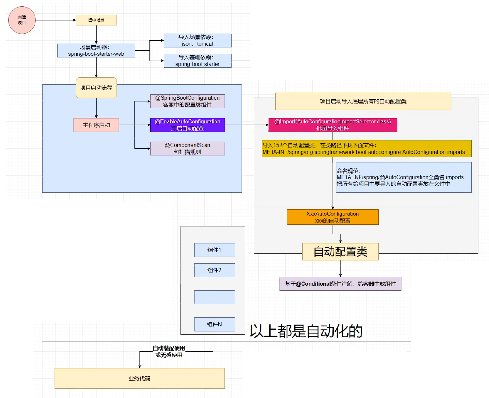

<!-- TOC -->

* [Spring Boot auto configuration](#spring-boot-auto-configuration)
    * [example: change default data source](#example-change-default-data-source)
    * [启用调试日志](#启用调试日志)
    * [Spring Boot 自动配置的源码解析](#spring-boot-自动配置的源码解析)
        * [1. **`@SpringBootApplication` 注解**](#1-springbootapplication-注解)
        * [2. **`@EnableAutoConfiguration` 注解**](#2-enableautoconfiguration-注解)
            * [2.1 `@AutoConfigurationPackage`](#21-autoconfigurationpackage)
            * [2.2 `AutoConfigurationImportSelector`](#22-autoconfigurationimportselector)
        * [3. **`spring.factories` 文件**](#3-springfactories-文件)
        * [4. **条件注解**](#4-条件注解)
        * [5. **`@AutoConfigureAfter` 和 `@AutoConfigureBefore`**](#5-autoconfigureafter-和-autoconfigurebefore)
        * [6. **自动配置报告**](#6-自动配置报告)
        * [7. **排除自动配置类**](#7-排除自动配置类)
        * [8. **自定义自动配置类**](#8-自定义自动配置类)
* [@ConfigurationProperties](#configurationproperties)
* [@EnableConfigurationProperties](#enableconfigurationproperties)
* [常用的 `application.properties` 配置项](#常用的-applicationproperties-配置项)
    * [服务器配置](#服务器配置)
    * [应用程序配置](#应用程序配置)
        * [数据源配置](#数据源配置)
    * [日志配置](#日志配置)
    * [安全配置](#安全配置)
    * [模板引擎配置](#模板引擎配置)
    * [静态资源配置](#静态资源配置)
    * [跨域配置](#跨域配置)
    * [Programming Method](#programming-method)
* [Log](#log)
    * [A Simple Logging Example](#a-simple-logging-example)
    * [log level](#log-level)
        * [spring log level:](#spring-log-level)
    * [logging group](#logging-group)
    * [Output log to file](#output-log-to-file)
    * [log archive and split to chunks](#log-archive-and-split-to-chunks)
    * [string format in log](#string-format-in-log)
    * [change to log4j2](#change-to-log4j2)

<!-- TOC -->

# Spring Boot auto configuration

## example: change default data source

- method 1

```java

@Configuration
public class DataSourceConfig {

    @Value("${spring.datasource.url}")
    private String url;
    @Value("${spring.datasource.username}")
    private String username;
    @Value("${spring.datasource.password}")
    private String password;
    @Value("${spring.datasource.driver-class-name}")
    private String driverClassName;

    @Bean
    DataSource dataSource() {
        DruidDataSource dataSource = new DruidDataSource();
        dataSource.setUrl(url);
        dataSource.setUsername(username);
        dataSource.setPassword(password);
        dataSource.setDriverClassName(driverClassName);
        return dataSource;
    }
}
```

- method 2

```properties
# application.properties
spring.datasource.type=com.alibaba.druid.pool.DruidDataSource
```

## 启用调试日志

- 在 `application.properties` 或 `application.yaml` 中添加以下配置以启用更多的调试信息：

```properties
logging.level.org.springframework.boot.autoconfigure=DEBUG
```

## Spring Boot 自动配置的源码解析

Spring Boot 的自动配置机制是其核心特性之一，它通过一系列复杂的类和注解来实现。理解其工作原理有助于更好地掌握如何自定义和调试自动配置。以下是
Spring Boot 自动配置的主要组成部分及其在源码中的实现。



### 1. **`@SpringBootApplication` 注解**

`@SpringBootApplication` 是 Spring Boot 应用程序中最常用的注解，它实际上是以下三个注解的组合：

- `@Configuration`：标记该类为一个配置类。
- `@EnableAutoConfiguration`：启用自动配置。
- `@ComponentScan`：扫描组件，默认从当前包及其子包中查找组件。

```java

@SpringBootConfiguration
@EnableAutoConfiguration
@ComponentScan(excludeFilters = {
        @Filter(type = FilterType.CUSTOM, classes = TypeExcludeFilter.class),
        @Filter(type = FilterType.CUSTOM, classes = AutoConfigurationExcludeFilter.class)
})
public @interface SpringBootApplication {
    // ...
}
```

### 2. **`@EnableAutoConfiguration` 注解**

`@EnableAutoConfiguration` 是自动配置的核心注解，它会触发自动配置类的加载。具体来说，它会读取 `META-INF/spring.factories`
文件，并根据条件选择合适的配置类。

```java

@AutoConfigurationPackage
@Import(AutoConfigurationImportSelector.class)
public @interface EnableAutoConfiguration {
    // ...
}
```

#### 2.1 `@AutoConfigurationPackage`

`@AutoConfigurationPackage` 注解的作用是将主应用程序类所在的包注册为默认的包扫描路径。这样，Spring Boot 可以在该包及其子包中查找组件。

```java

@Import(AutoConfigurationPackages.Registrar.class)
public @interface AutoConfigurationPackage {
}
```

#### 2.2 `AutoConfigurationImportSelector`

`AutoConfigurationImportSelector` 类是自动配置的核心部分，它负责加载 `spring.factories` 文件中的自动配置类。具体来说，它实现了
`ImportSelector` 接口，并重写了 `selectImports` 方法。

```java
public class AutoConfigurationImportSelector implements ImportSelector, DeferredImportSelector, BeanClassLoaderAware, ResourceLoaderAware {
    // ...
}
```

- `selectImports` 方法的工作流程如下：
    1. **读取 `spring.factories` 文件**：从 `META-INF/spring.factories` 文件中读取所有自动配置类的全限定名。
    2. **过滤自动配置类**：根据条件注解（如 `@ConditionalOnClass`, `@ConditionalOnMissingBean`, `@ConditionalOnProperty`
       等）过滤出符合条件的自动配置类。
    3. **返回自动配置类列表**：将符合条件的自动配置类作为字符串数组返回给 Spring 容器，以便创建相应的 Bean。

### 3. **`spring.factories` 文件**

`spring.factories` 文件位于 `META-INF/` 目录下，用于声明自动配置类。例如：

```properties
org.springframework.boot.autoconfigure.EnableAutoConfiguration=\
org.springframework.boot.autoconfigure.admin.SpringApplicationAdminJmxAutoConfiguration,\
org.springframework.boot.autoconfigure.aop.AopAutoConfiguration,\
org.springframework.boot.autoconfigure.amqp.RabbitAutoConfiguration,\
...
```

Spring Boot 启动时会读取这个文件并加载其中列出的自动配置类。

### 4. **条件注解**

自动配置类通常使用条件注解来决定是否应用某个配置。常见的条件注解包括：

- `@ConditionalOnClass`：只有当指定的类存在时才应用配置。
- `@ConditionalOnMissingBean`：只有当没有特定类型的 Bean 存在时才应用配置。
- `@ConditionalOnProperty`：根据配置文件中的属性值决定是否应用配置。
- `@ConditionalOnWebApplication`：只有在 Web 应用程序中才应用配置。
- `@ConditionalOnNotWebApplication`：只有在非 Web 应用程序中才应用配置。

例如，`DataSourceAutoConfiguration` 类使用了这些条件注解：

```java

@Configuration(proxyBeanMethods = false)
@ConditionalOnClass({DataSource.class, EmbeddedDatabaseType.class})
@EnableConfigurationProperties(DataSourceProperties.class)
@Import({DataSourcePoolMetadataProvidersConfiguration.class, DataSourceInitializationConfiguration.class})
public class DataSourceAutoConfiguration {
    // ...
}
```

### 5. **`@AutoConfigureAfter` 和 `@AutoConfigureBefore`**

这些注解用于控制自动配置类的加载顺序。例如，`HibernateJpaAutoConfiguration` 需要在 `DataSourceAutoConfiguration` 之后加载：

```java

@Configuration(proxyBeanMethods = false)
@ConditionalOnClass({EntityManager.class, EntityManagerFactory.class})
@ConditionalOnBean(DataSource.class)
@AutoConfigureAfter(DataSourceAutoConfiguration.class)
public class HibernateJpaAutoConfiguration {
    // ...
}
```

### 6. **自动配置报告**

Spring Boot 提供了一个自动配置报告，可以在启动时输出到控制台，可以通过以下方式启用：

```properties
debug=true
```

这将显示哪些自动配置类被应用，哪些被排除，以及原因。

### 7. **排除自动配置类**

如果需要禁用某些自动配置类，可以在主应用程序类或配置类中使用 `@SpringBootApplication` 注解的 `exclude` 属性：

```java

@SpringBootApplication(exclude = {DataSourceAutoConfiguration.class})
public class MyApplication {
    public static void main(String[] args) {
        SpringApplication.run(MyApplication.class, args);
    }
}
```

或者直接在 `application.properties` 或 `application.yml` 中配置：

```properties
spring.autoconfigure.exclude=org.springframework.boot.autoconfigure.jdbc.DataSourceAutoConfiguration
```

### 8. **自定义自动配置类**

创建自己的自动配置类可以参考以下步骤：

1. **创建配置类**：编写一个带有 `@Configuration` 注解的类。
2. **添加条件注解**：根据需要添加条件注解，确保配置类仅在特定条件下生效。
3. **注册自动配置类**：将自动配置类添加到 `META-INF/spring.factories` 文件中。

例如：

```java

@Configuration
@ConditionalOnClass(RedisOperations.class)
@ConditionalOnProperty(prefix = "myapp.redis", name = "enabled", havingValue = "true")
public class RedisAutoConfiguration {

    @Bean
    public RedisTemplate<String, Object> redisTemplate(RedisConnectionFactory factory) {
        RedisTemplate<String, Object> template = new RedisTemplate<>();
        template.setConnectionFactory(factory);
        return template;
    }
}
```

然后在 `META-INF/spring.factories` 中添加：

```properties
org.springframework.boot.autoconfigure.EnableAutoConfiguration=com.example.RedisAutoConfiguration
```

# @ConfigurationProperties

- Bind Bean properties with Spring Boot Properties

```properties
abc.a=a
abc.b=b
abc.c=c
```

```java
package com.li.hellospringbootbase1.properties;

import lombok.Data;
import org.springframework.boot.context.properties.ConfigurationProperties;
import org.springframework.stereotype.Component;

@Component
@Data
@ConfigurationProperties(prefix = "abc")
public class MyAutoConfiguration {
    private String a;
    private String b;
    private String c;
}

```

# @EnableConfigurationProperties

- annotate spring boot application class with `@EnableConfigurationProperties(xxx.class)`
  to add xxx.class to spring context and enable `@ConfigurationProperties` in xxx.class
  if xxx.class is not annotated with `@Component`

在Spring Boot应用程序中，`application.properties` 或 `application.yml` 文件用于配置各种属性。以下是一些常用的配置项及其用途：

# 常用的 `application.properties` 配置项

## 服务器配置

- **服务器端口**
  ```properties
  server.port=8080
  ```


- **服务器上下文路径**
  ```properties
  server.servlet.context-path=/myapp
  ```


- **最大线程数**
  ```properties
  server.tomcat.max-threads=200
  ```


- **连接超时时间**
  ```properties
  server.connection-timeout=20000
  ```

## 应用程序配置

- **应用程序名称**
  ```properties
  spring.application.name=my-application
  ```


- **激活的配置文件**
  ```properties
  spring.profiles.active=dev
  ```

#### 数据源配置

- **JDBC URL**
  ```properties
  spring.datasource.url=jdbc:mysql://localhost:3306/mydb
  ```


- **用户名和密码**
  ```properties
  spring.datasource.username=root
  spring.datasource.password=root
  ```


- **驱动类名**
  ```properties
  spring.datasource.driver-class-name=com.mysql.cj.jdbc.Driver
  ```


- **连接池配置**
  ```properties
  spring.datasource.hikari.maximum-pool-size=10
  spring.datasource.hikari.minimum-idle=5
  spring.datasource.hikari.idle-timeout=30000
  spring.datasource.hikari.max-lifetime=1800000
  ```

## 日志配置

- **日志级别**
  ```properties
  logging.level.root=INFO
  logging.level.org.springframework.web=DEBUG
  logging.level.com.example.demo=TRACE
  ```


- **日志文件路径**
  ```properties
  logging.file.name=app.log
  ```

## 安全配置

- **启用安全**
  ```properties
  spring.security.enabled=true
  ```


- **默认用户名和密码**
  ```properties
  spring.security.user.name=user
  spring.security.user.password=password
  ```

## 模板引擎配置

- **Thymeleaf 缓存**
  ```properties
  spring.thymeleaf.cache=false
  ```


- **模板文件路径**
  ```properties
  spring.thymeleaf.prefix=classpath:/templates/
  spring.thymeleaf.suffix=.html
  ```

## 静态资源配置

- **静态资源路径**
  ```properties
  spring.resources.static-locations=classpath:/static/,classpath:/public/,classpath:/resources/,classpath:/META-INF/resources/
  ```

## 跨域配置

- **允许的来源**
  ```properties
  spring.mvc.cors.allowed-origins=http://example.com
  ```


- **允许的方法**
  ```properties
  spring.mvc.cors.allowed-methods=GET,POST,PUT,DELETE,OPTIONS
  ```


- **允许的头信息**
  ```properties
  spring.mvc.cors.allowed-headers=*
  ```


- **是否允许凭证**
  ```properties
  spring.mvc.cors.allow-credentials=true
  ```

## Programming Method

```java
package com.li.hellospringbootbase1;

import org.springframework.boot.Banner;
import org.springframework.boot.SpringApplication;
import org.springframework.boot.autoconfigure.SpringBootApplication;
import org.springframework.boot.builder.SpringApplicationBuilder;
import org.springframework.core.env.Environment;

import java.io.PrintStream;

@SpringBootApplication
public class HelloSpringbootBase1Application {

    public static void main(String[] args) {

//        method 1
        SpringApplication.run(HelloSpringbootBase1Application.class, args);
//        method 2
        SpringApplication springApplication = new SpringApplication(HelloSpringbootBase1Application.class);
        springApplication.setLazyInitialization(true);
        springApplication.setBannerMode(Banner.Mode.OFF);
        springApplication.setEnvironment(null);
        springApplication.run(args);
//        method 3
        SpringApplicationBuilder builder = new SpringApplicationBuilder();
        builder
                .sources(HelloSpringbootBase1Application.class)
                .bannerMode(Banner.Mode.OFF)
                .environment(null)
                .lazyInitialization(true)
                .run(args);

    }

}
```

# Log

## A Simple Logging Example

```java
package com.li.hellospringbootbase1;

import lombok.extern.slf4j.Slf4j;
import org.junit.jupiter.api.Test;
import org.slf4j.Logger;
import org.slf4j.LoggerFactory;
import org.springframework.boot.test.context.SpringBootTest;

@SpringBootTest
@Slf4j
public class LogTest {

    //    Logger log = LoggerFactory.getLogger(LogTest.class);// = @Slf4j
    @Test
    void logTest() {


        log.trace("trace");
        log.debug("debug");
        log.info("info");
        log.warn("warn");
        log.error("error");
    }
}

```

## log level

- default log level is `info`
- change default log level in `application.properties` by setting `logging.level.root=debug`
- change log level for specific package by setting `logging.level.com.li.hellospringbootbase1=debug`

### spring log level:

- trace
- debug
- info
- warn
- error
- fatal
- off

## logging group

```properties
logging.group.group-name=com.li.hellospringbootbase1.service,com.li.hellospringbootbase1.dao
logging.level.group-name=debug
```

## Output log to file

- set `logging.file.name` **or** `logging.file.path` in spring properties
- `logging.file.path=[directory path]`
- `logging.file.name=[log file path]`
- `logging.file.name` has higher priority than `logging.file.path`

## log archive and split to chunks

- logback

```xml
<!--logback-spring.xml-->
<configuration>
    <!-- 定义日志文件路径和文件名 -->
    <property name="LOG_PATH" value="logs"/>
    <property name="LOG_FILE" value="my-application.log"/>

    <appender name="STDOUT" class="ch.qos.logback.core.ConsoleAppender">
        <encoder>
            <pattern>%d{yyyy-MM-dd HH:mm:ss} - %msg%n</pattern>
        </encoder>
    </appender>

    <appender name="FILE" class="ch.qos.logback.core.rolling.RollingFileAppender">
        <!-- 当前日志文件路径 -->
        <file>${LOG_PATH}/${LOG_FILE}</file>
        <encoder>
            <pattern>%d{yyyy-MM-dd HH:mm:ss} [%thread] %-5level - %msg%n</pattern>
        </encoder>

        <!-- 滚动策略 -->
        <rollingPolicy class="ch.qos.logback.core.rolling.TimeBasedRollingPolicy">
            <!-- 归档日志文件路径和命名模式 -->
            <fileNamePattern>${LOG_PATH}/my-application-%d{yyyy-MM-dd}.%i.log.gz</fileNamePattern>
            <!-- 最大历史日志文件数量 -->
            <maxHistory>30</maxHistory>
            <!-- 按大小分割日志文件 -->
            <timeBasedFileNamingAndTriggeringPolicy class="ch.qos.logback.core.rolling.SizeAndTimeBasedFNATP">
                <maxFileSize>10MB</maxFileSize>
            </timeBasedFileNamingAndTriggeringPolicy>
        </rollingPolicy>
    </appender>

    <root level="INFO">
        <appender-ref ref="FILE"/>
    </root>
</configuration>

```

- log4j2

```xml
<!--log4j2-spring.xml -->
<Configuration status="WARN">
    <Properties>
        <Property name="LOG_PATH">${sys:LOG_PATH}</Property>
        <Property name="LOG_FILE">${sys:LOG_FILE}</Property>
        <Property name="LOG_MAX_SIZE">${sys:LOG_MAX_SIZE}</Property>
        <Property name="LOG_MAX_HISTORY">${sys:LOG_MAX_HISTORY}</Property>
    </Properties>

    <Appenders>
        <RollingFile name="RollingFile" fileName="${LOG_PATH}/${LOG_FILE}"
                     filePattern="${LOG_PATH}/my-application-%d{yyyy-MM-dd}-%i.log.gz">
            <PatternLayout>
                <Pattern>%d{yyyy-MM-dd HH:mm:ss} - %msg%n</Pattern>
            </PatternLayout>
            <Policies>
                <TimeBasedTriggeringPolicy/>
                <SizeBasedTriggeringPolicy size="${LOG_MAX_SIZE}"/>
            </Policies>
            <DefaultRolloverStrategy max="${LOG_MAX_HISTORY}"/>
        </RollingFile>
    </Appenders>

    <Loggers>
        <Root level="info">
            <AppenderRef ref="RollingFile"/>
        </Root>
    </Loggers>
</Configuration>

```

- spring properties

```properties
# log archive filename pattern
logging.logback.rollingpolicy.file-name-pattern=${LOG_FILE}.%d{yyyy-MM-dd}.%i.gz
# if clean history log archive
logging.logback.rollingpolicy.clean-history-on-start=true
# max size of single log archive file
logging.logback.rollingpolicy.max-file-size=10MB
# max size of total log archives, 0B is no limit
logging.logback.rollingpolicy.total-size-cap=300MB
# reserve days of history log archives
logging.logback.rollingpolicy.max-history=30
```

## string format in log

```java
void logTest() {
    int a = 1;
    log.info("abc.a={}", a);
}
```

## change to log4j2

- exclusion `spring-boot-starter-logging` in `spring-boot-starter-web`
- add `spring-boot-starter-log4j2`

```xml

<dependencies>
    <!-- 其他依赖 -->

    <dependency>
        <groupId>org.springframework.boot</groupId>
        <artifactId>spring-boot-starter-web</artifactId>
        <exclusions>
            <exclusion>
                <groupId>org.springframework.boot</groupId>
                <artifactId>spring-boot-starter-logging</artifactId>
            </exclusion>
        </exclusions>
    </dependency>

    <!-- 添加Log4j2依赖 -->
    <dependency>
        <groupId>org.springframework.boot</groupId>
        <artifactId>spring-boot-starter-log4j2</artifactId>
    </dependency>

    <!-- 其他依赖 -->
</dependencies>

```

# spring environment isolation

- touch and modify `application-xxx.properties` to set environment specific properties
- annotated bean and components with `@Profile("xxx")` to enable them in xxx environment and disable them in other
  different environments

- activate environment `xxx`:
    - method 1: set `spring.profiles.active=xxx` in `application.properties` to set current environment, then all the
      setting belongs
      to `xxx` environment has higher priority than that belongs to default environment
    - method 2: `java -jar springProject.jar --spring.profiles.active=xxx` on command line
- `spring.profiles.include=xxx1,xxx2` to include xxx1 and xxx2 environments whatever the current environment is
- `spring.profiles.groups.xx[0]=xxx1` and `spring.profiles.groups.xx[1]=xxx2` to group xxx1 and xxx2 environments as xxx
  group, then `spring.profiles.active=xx` will activate xxx1 and xxx2 environments

## Outer properties

- all valid outer `application.properties` path:
    ```
    - deploy_dir
        - config
            - xxx
                - application.properties
            - application.properties
        - app.jar
        - application.properties
    ```

- priority of properties:
    - (outer) config/xxx/application.properties (highest)
    - (outer) config/application.properties
    - (outer) application.properties
    - (inner) app.jar/application.properties (lowest)
    - properties in <text style="color:orange">inner activated</text> environments have <text style="color:red">
      higher</text> priority than <text style="color:orange">outer default</text> properties

# Unit Test

## 常用的注解

- **`@SpringBootTest`**：
    - 用于标注测试类，它会启动整个Spring应用上下文，适用于集成测试。
    - 可以通过`classes`属性指定加载的配置类，默认是主应用类。
    - 支持不同的webEnvironment类型，如定义是否启动mock或真实的Servlet环境。

- **`@Test`**：
    - 来自JUnit Jupiter，用于标注测试方法，表示该方法是一个测试用例。

- **`@DisplayName("test name")`**：
    - 同样来自JUnit Jupiter，为测试类或测试方法设置一个可读的名字，替代默认的方法名显示。

- **`@BeforeEach`** 和 **`@AfterEach`**：
    - 分别在每个测试方法执行之前和之后运行，可用于设置前置条件或清理工作。

- **`@BeforeAll`** 和 **`@AfterAll`**：
    - 在所有测试方法执行之前和之后各执行一次，通常用于一次性初始化或资源释放操作。

```java
import org.junit.jupiter.api.*;

import static org.junit.jupiter.api.Assertions.*;

public class ExampleTest {

    // 用于存储测试数据
    private static StringBuilder output;

    // 在所有测试方法执行之前运行一次
    @BeforeAll
    static void setUpBeforeAll() {
        System.out.println("Running @BeforeAll");
        output = new StringBuilder();
    }

    // 在所有测试方法执行之后运行一次
    @AfterAll
    static void tearDownAfterAll() {
        System.out.println("Running @AfterAll");
        output = null;
    }

    // 在每个测试方法执行之前运行
    @BeforeEach
    void setUpBeforeEach() {
        System.out.println("Running @BeforeEach");
        output.setLength(0); // 清空StringBuilder
    }

    // 在每个测试方法执行之后运行
    @AfterEach
    void tearDownAfterEach() {
        System.out.println("Running @AfterEach");
        System.out.println("Final output: " + output.toString());
    }

    @Test
    @DisplayName("Test method 1")
    void testMethod1() {
        System.out.println("Running testMethod1");
        output.append("Hello");
        assertEquals("Hello", output.toString());
    }

    @Test
    @DisplayName("Test method 2")
    void testMethod2() {
        System.out.println("Running testMethod2");
        output.append("World");
        assertEquals("World", output.toString());
    }
}

```

## assert

- `assertEquals`
- `assertNotEquals`
- `assertSame`
- `assertNotSame`
- `assertTrue`
- `assertFalse`
- `assertNull`
- `assertNotNull`
- `assertArrayEquals`
- `assertAll`
- `assertThrows`
- `assertTimeout`
- `fail`


- `assertSame` and `assertNotSame` 验证两个对象<text style="color:orange">引用同一个对象</text>
  ```java
  Object obj1 = new Object();
  Object obj2 = new Object();
  assertNotSame(obj1, obj2); // 通过

  Object obj3 = obj1;
  assertNotSame(obj1, obj3); // 失败
  ```

### Example

```java
import org.junit.jupiter.api.Test;

import static org.junit.jupiter.api.Assertions.*;

public class ExampleTest {

    @Test
    void testAssertions() {
        int a = 10;
        int b = 5;
        String str1 = "Hello";
        String str2 = "World";
        Object obj1 = new Object();
        Object obj2 = obj1;

        assertEquals(a, 10);
        assertNotEquals(a, b);
        assertTrue(a > b);
        assertFalse(a < b);
        assertNull(null);
        assertNotNull(obj1);
        assertSame(obj1, obj2);
        assertNotSame(obj1, new Object());

        assertThrows(IllegalArgumentException.class, () -> {
            throw new IllegalArgumentException("Invalid argument");
        });

        assertDoesNotThrow(() -> {
            // 无异常代码
        });

        assertAll(
                () -> assertEquals(a, 10),
                () -> assertEquals(str1, "Hello"),
                () -> assertTrue(a > b)
        );
    }
}

```